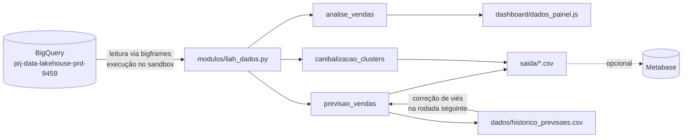

# Previsão de Vendas Liah

Análise de vendas, previsão de demanda e estudo de canibalização da Liah. Os dados vêm do BigQuery pela biblioteca [BigQuery DataFrames (bigframes)](https://pypi.org/project/bigframes/), e o projeto roda em notebooks no Google Colab.

> Análise interna, sujeita a validação pela área responsável. As previsões são estimativas estatísticas, não metas nem números oficiais da Tecsa. Material para cliente, imprensa ou parceiros precisa de aprovação interna antes de ser divulgado.

## O que o projeto entrega

| Notebook | Resultado |
|---|---|
| `analise_vendas_liah_bigframes.ipynb` | Análise descritiva: tendências, sazonalidade, padrões por dia da semana e do mês, datas especiais e mix por canal, região, UF, grupo, subgrupo e marca. Gera os dados do painel HTML. |
| `previsao_vendas_v5_bigframes.ipynb` | Previsão de pedidos e faturamento: 6 meses no total e 3 meses por nível (canal, origem, região, UF, grupo, subgrupo, marca, produto). Cada nível usa o modelo que errou menos no backtest, com preferência pelo mais simples. |
| `canibalizacao_clusters_liah.ipynb` | Produtos que concorrem entre si, produtos comprados juntos, KNN de produtos parecidos e K-means de produtos e marcas. |



## Estrutura do repositório

```
.
├── analise_vendas_liah_bigframes.ipynb
├── canibalizacao_clusters_liah.ipynb
├── previsao_vendas_v5_bigframes.ipynb
├── modulos/
│   ├── liah_dados.py          # conexão bigframes, regra de limpeza, detecção de colunas, todas as consultas
│   └── previsao_modelos.py    # catálogo de modelos, backtest, regra de escolha (genérico, reutilizável)
├── dashboard/
│   └── painel_vendas_liah.html  # painel offline; lê dados_painel.js da mesma pasta
├── docs/
│   └── queries_previsao_vendas_v5.sql  # consultas para o console do BigQuery e para o Metabase
├── teste/
│   └── gerar_sinteticos.py    # dados fictícios para rodar tudo sem acessar o BigQuery
├── dados/                     # gerado: histórico de previsões e cache das consultas (fora do git)
└── saida/                     # gerado: resultados em CSV e JSON (fora do git)
```

## Requisitos

- Google Colab (recomendado) ou Python 3.11+
- Acesso de leitura aos datasets `gold_core` e `silver_b2c` em `prj-data-lakehouse-prd-9459`
- Papel **BigQuery User** em `prj-sbx-data-liah-4956`, o projeto que executa e paga as consultas

Bibliotecas: veja `requirements.txt`. No Colab, a primeira célula de cada notebook instala só o que estiver faltando, sem atualizar o que já vem instalado.

## Como rodar

### No Colab, com Google Drive (uso normal)

1. Copie o repositório para `Meu Drive/previsao_vendas`, mantendo a estrutura de pastas.
2. Abra um notebook no Colab.
3. Monte o Drive pelo ícone na barra lateral (Arquivos > Montar Drive), aceitando todas as permissões.
4. Execute **Ambiente de execução > Executar tudo** e faça login no Google Cloud quando pedido.
5. Confira na célula de conexão:
   - `consultas executadas e faturadas em: prj-sbx-data-liah-4956`
   - a tabela de colunas detectadas (marca, grupo, subgrupo, UF). Se alguma não for encontrada, informe em `COLUNAS_MANUAIS`.

Ordem sugerida a cada mês: análise, canibalização, previsão. Na rodada oficial, use `REUSAR_CACHE_HORAS = 0`.

### Localmente, sem BigQuery (teste)

```bash
pip install -r requirements.txt
python teste/gerar_sinteticos.py dados/cache_dados
LIAH_MODO=offline jupyter nbconvert --to notebook --execute previsao_vendas_v5_bigframes.ipynb
```

Antes, defina `PASTA_DRIVE = None` no notebook. Os dados gerados são fictícios.

### Localmente, com BigQuery

```bash
gcloud auth application-default login
```

Depois defina `PASTA_DRIVE = None` e rode o notebook com `MODO = 'bigquery'`.

## Principais parâmetros

Ficam na célula de parâmetros de cada notebook.

| Parâmetro | Padrão | Função |
|---|---|---|
| `MODO` | `bigquery` | `offline` lê só o cache local, sem custo |
| `PROJETO_EXECUCAO` | `prj-sbx-data-liah-4956` | Projeto que executa e paga as consultas |
| `LOCAL_BQ` | `None` | Região do BigQuery, se necessário |
| `PASTA_DRIVE` | `/content/drive/MyDrive/previsao_vendas` | Pasta de trabalho no Colab |
| `REUSAR_CACHE_HORAS` | `12` | Reaproveita consultas idênticas do mesmo dia |
| `COLUNAS_MANUAIS` | `{}` | Corrige nomes de colunas não detectados |
| `TOLERANCIA_PARCIMONIA` | `0.05` | Aceita modelo mais simples com erro até 5% maior que o melhor |
| `USAR_ARIMA_PLUS` | `True` | Inclui o ARIMA_PLUS do BigQuery ML no benchmark |
| `USAR_TIMESFM` | `False` | Inclui o TimesFM (exige Vertex AI) |
| `DATASET_SAIDA` | `None` | Dataset do sandbox para gravar as tabelas do Metabase |
| `MANTER_RODADAS_ANTERIORES` | `True` | Mantém rodadas anteriores em `saida/` e substitui só a da mesma data |

## Metodologia

### Pedidos válidos

Ficam de fora pedidos cancelados, recusados, com PIX não pago, aguardando pagamento, pendentes e de contas de teste. A regra fica só em `modulos/liah_dados.py`.

**Pedidos extremos** (acima de R$ 5 mil, ou grupos de pedidos idênticos em ±7 dias) são tratados à parte. A previsão sai em duas versões:

- **V1:** só a base recorrente;
- **V2:** V1 mais o valor médio esperado de extremos.

### Benchmark do mais simples ao mais complexo

| Complexidade | Modelos |
|---|---|
| 0 | Ingênuo, Média móvel, Sazonal ingênuo |
| 1 | Sazonal × crescimento |
| 2 | ETS (Holt-Winters), ARIMA |
| 3 | SARIMAX com calendário, Prophet, ARIMA_PLUS (BigQuery ML) |
| 4 | GradientBoosting + XGBoost com variáveis de calendário |
| 5 | Híbrido Prophet + XGBoost nos resíduos |
| 6 | Combinação dos 3 melhores, Top-down (pai × participação) |

- Backtest com várias origens: diário para o total, semanal para os demais níveis.
- Erro medido em WAPE mensal.
- Fica o modelo mais simples cujo erro está a até `TOLERANCIA_PARCIMONIA` do melhor, e a justificativa sai em texto.
- O "Sazonal ingênuo" é a referência que todo modelo precisa superar.

Para acrescentar um modelo, escreva `fn(y, futuro, ctx, params)` em `previsao_modelos.py` e registre em `catalogo_padrao()` com seu nível de complexidade.

### Aprendizado entre rodadas

Cada execução registra a previsão em `dados/historico_previsoes.csv`. Na rodada seguinte, as previsões dos meses fechados são comparadas com o realizado. Com viés consistente em pelo menos 3 meses, a nova previsão é corrigida na proporção do viés, com limite de ±15%.

### Canibalização

Cruza quatro sinais:

- **taxa de canibalização** em semanas de pico;
- **correlação** das variações semanais, descontado o movimento da loja inteira;
- **lift de cesta**;
- **vizinhos no KNN**.

Cada par é classificado como "Concorrem entre si", "Complementares" ou "Sem relação clara". Correlação não prova causa: os pares devem ser confirmados com o time comercial.

## Custos

- Cada notebook baixa dois cubos semanais já agregados no BigQuery (produto e geográfico) e calcula todos os cortes localmente.
- Consultas idênticas no mesmo dia vêm do cache em `dados/cache_dados`.
- A última célula mostra quantas consultas foram ao BigQuery.
- Para o consumo real, consulte `INFORMATION_SCHEMA.JOBS_BY_USER` no projeto de execução (exemplo em `docs/queries_previsao_vendas_v5.sql`).

## Saídas

| Arquivo em `saida/` | Conteúdo |
|---|---|
| `liah_previsao_mensal.csv` | V1, V2, faixas e a frase que explica cada número |
| `liah_previsao_granular.csv` | Previsão por nível, série e mês, direta e reconciliada com o total |
| `liah_realizado_granular.csv` | Realizado dos últimos 12 meses por nível e série |
| `liah_benchmark_modelos.csv` | Erro de cada modelo por nível, escolhido e justificativa |
| `liah_hiperparametros.csv`, `hiperparametros_AAAA-MM-DD.json` | Parâmetros e escolhas de cada rodada |
| `liah_arima_plus_ordens.csv` | Ordens escolhidas pelo ARIMA_PLUS |
| `liah_canibalizacao_*.csv`, `liah_produtos_vizinhos.csv`, `liah_clusters_*.csv` | Canibalização e clusters |

Com `DATASET_SAIDA` preenchido, as mesmas tabelas vão para o BigQuery. As consultas M1 a M5 em `docs/` leem essas tabelas no Metabase.

## Segurança e dados

- As consultas são somente leitura. Nada é gravado no projeto de produção, e `salvar_tabela` recusa destinos em `gold_core` ou `silver`.
- Os resultados trazem só números agregados e ids de pedido e produto. Não acrescente e-mail, nome, endereço ou dados de paciente ou nutricionista.
- `dados/`, `saida/` e `dashboard/dados_painel.*` contêm números internos de vendas e estão no `.gitignore`. Não os suba para o repositório.
- O código cita projetos e tabelas internas da Tecsa: mantenha o repositório **privado**.
- Nunca inclua credenciais, chaves ou tokens no repositório. A autenticação é feita pelo login do Google no Colab ou pelo `gcloud`.

## Pendências de validação

- Data de abertura ao público (`DATA_ABERTURA`), inferida dos dados.
- Hipótese de que pedido sem nutricionista equivale a público aberto.
- Nomes reais das colunas de marca, grupo, subgrupo e UF em `dim_liah_produtos`.
- Dataset do sandbox para as tabelas do Metabase.
